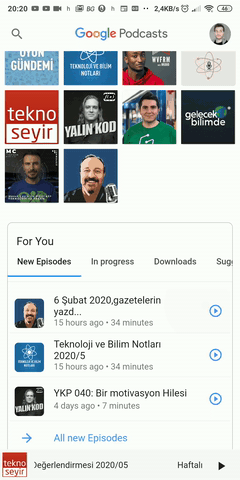
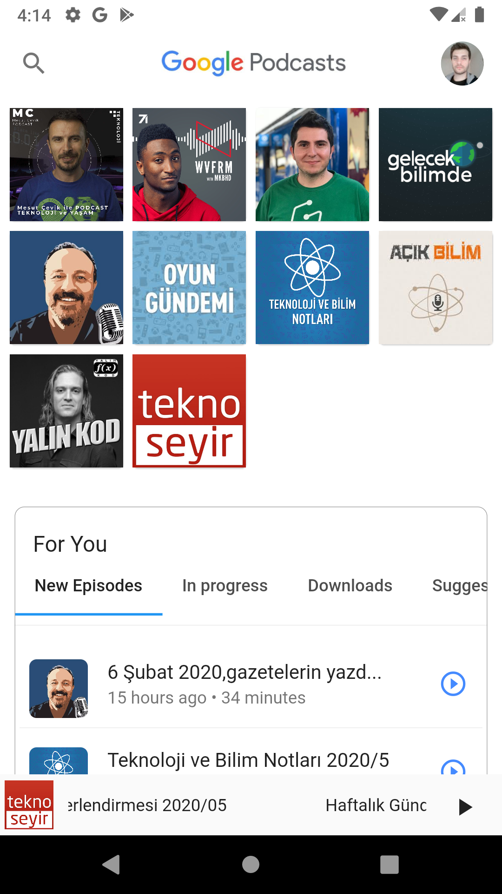
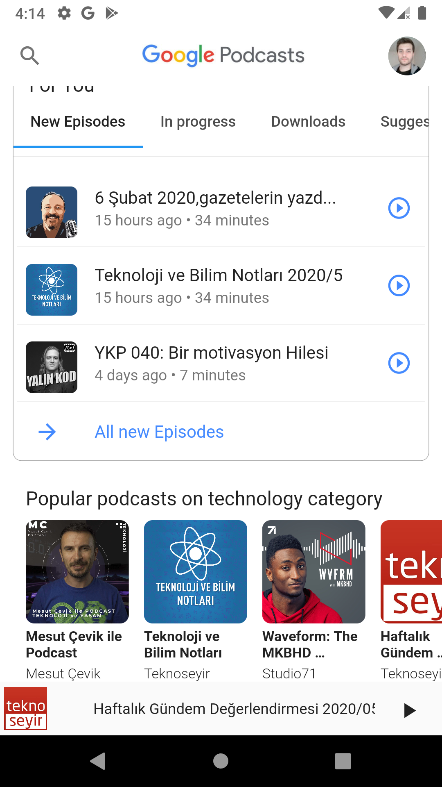
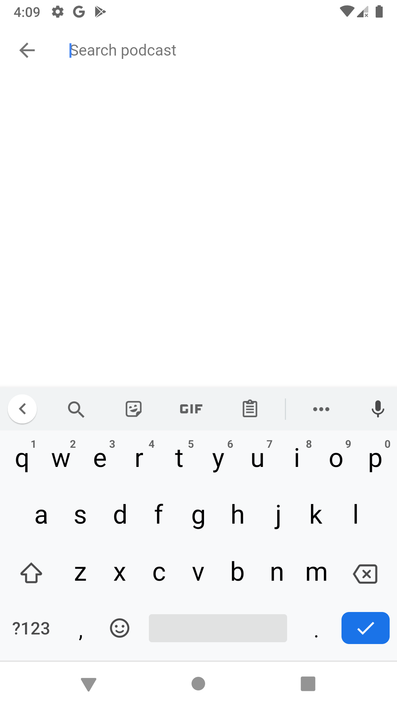
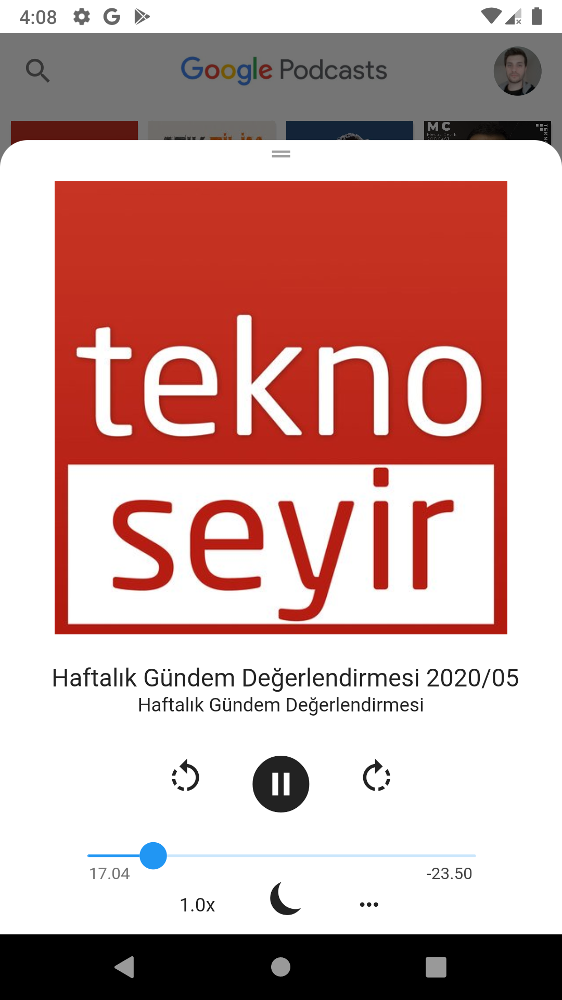

# Flutter Google Podcast Clone

Google Podcast uygulaması flutter ve dart kullanarak yeniden yazılmıştır. Örnek bir podcast dosyası çalmak haricinde işlevselliği yoktur. Sadece tasarım yeniden yapılmıştır. Modüler yapıda kodlanmıştır. İleride geliştirmeler yapılabilir.

Android için [Uygulamayı İndir](app.apk)

This project is clone of a Google Podcast app using Flutter and Dart.

[Download App](app.apk) for Android
<!-- Place this tag where you want the button to render. -->
### Video

### ScreenShots

For help getting started with Flutter, view our
[online documentation](https://flutter.dev/docs), which offers tutorials,
samples, guidance on mobile development, and a full API reference.

## Getting Started

This project is a starting point for a Flutter application.

A few resources to get you started if this is your first Flutter project:

- [Lab: Write your first Flutter app](https://flutter.dev/docs/get-started/codelab)
- [Cookbook: Useful Flutter samples](https://flutter.dev/docs/cookbook)

For help getting started with Flutter, view our
[online documentation](https://flutter.dev/docs), which offers tutorials,
samples, guidance on mobile development, and a full API reference.
